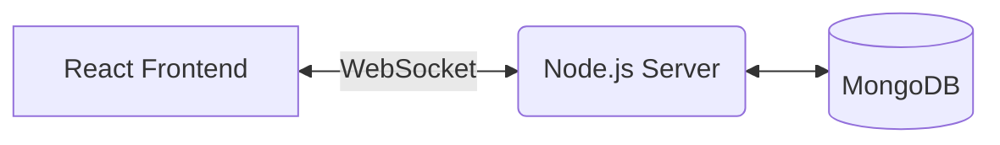

# Blueprints Hub Implementation Plan

> **For agentic workers:** REQUIRED SUB-SKILL: Use superpowers:subagent-driven-development (recommended) or superpowers:executing-plans to implement this plan task-by-task. Steps use checkbox (`- [ ]`) syntax for tracking.

**Goal:** Replace the language-specific resources with a "Blueprints Hub" that provides full-stack project architectures and AI prompting guides.

**Architecture:** We will update the SvelteKit data model (`types.ts`) to support `tech_stack` and `difficulty`, create a new Markdown folder for blueprints, and redesign the resources UI with a new `BlueprintCard` component.

**Tech Stack:** SvelteKit, TypeScript, MDsveX, TailwindCSS

---

### Task 1: Update Data Schema (`types.ts`)

**Files:**

- Modify: `src/lib/types.ts`

- [ ] **Step 1: Add new fields to the Item interface**

Update `src/lib/types.ts` to include optional properties for blueprints.

```typescript
// Add to Item interface in src/lib/types.ts
export interface Item {
  type: ItemType;
  path: string;
  displayName: string;
  tech_stack?: string[];
  difficulty?: string;
  description?: string;
}
```

- [ ] **Step 2: Run type check to verify it passes**

Run: `npm run check`
Expected: PASS with 0 errors

- [ ] **Step 3: Commit**

```bash
git add src/lib/types.ts
git commit -m "feat: add blueprint fields to Item interface"
```

---

### Task 2: Create BlueprintCard Component

**Files:**

- Create: `src/lib/components/BlueprintCard.svelte`

- [ ] **Step 1: Write the component implementation**

Create `src/lib/components/BlueprintCard.svelte`:

```svelte
<script lang="ts">
  import type { Item } from "$lib/types";
  export let blueprint: Item;
</script>

<a
  href={`/resources/${blueprint.path}`}
  class="flex flex-col gap-2 rounded-xl border-2 border-retro-black bg-retro-white p-4 transition-all hover:-translate-y-1 hover:shadow-[4px_4px_0px_0px_#232222]">
  <h3 class="font-header text-2xl">{blueprint.displayName}</h3>
  {#if blueprint.description}
    <p class="text-sm text-retro-gray">{blueprint.description}</p>
  {/if}

  <div class="mt-auto flex flex-wrap gap-2 pt-2">
    {#if blueprint.difficulty}
      <span
        class="rounded-full border border-pink-400 bg-pink-200 px-2 py-1 text-xs font-bold text-pink-900">
        {blueprint.difficulty}
      </span>
    {/if}
    {#if blueprint.tech_stack}
      {#each blueprint.tech_stack as tech}
        <span
          class="rounded-full border border-blue-300 bg-blue-100 px-2 py-1 text-xs text-blue-800">
          {tech}
        </span>
      {/each}
    {/if}
  </div>
</a>
```

- [ ] **Step 2: Run checks to verify syntax**

Run: `npm run check`
Expected: PASS with 0 errors

- [ ] **Step 3: Commit**

```bash
git add src/lib/components/BlueprintCard.svelte
git commit -m "feat: create BlueprintCard component"
```

---

### Task 3: Restructure Resources UI

**Files:**

- Modify: `src/routes/resources/+page.svelte`
- Modify: `src/lib/components/ResourceGroup.svelte`

- [ ] **Step 1: Update ResourceGroup to render BlueprintCards**

Modify `src/lib/components/ResourceGroup.svelte` to check if an item has a `tech_stack` and render the new card if so.

```svelte
<!-- Import BlueprintCard at the top -->
<script lang="ts">
  import { ItemType, type Item } from "$lib/types";
  import BlueprintCard from "./BlueprintCard.svelte";

  export let category: string;
  export let resources: Item[];
</script>

<!-- In the #each loop, replace the ItemType.Guide block or add a conditional -->
{#if resource.type === ItemType.Guide}
  {#if resource.tech_stack}
    <BlueprintCard blueprint={resource} />
  {:else}
    <!-- Keep the existing anchor tag block for legacy guides -->
    <a href={`/resources/${resource.path ?? "error"}`} class="flex flex-row px-3 py-1 transition ease-in odd:bg-retro-lightgray even:bg-retro-white hover:-translate-y-1 hover:text-pink-700">
      <!-- existing code -->
    </a>
  {/if}
<!-- ... rest of the existing if/else logic ... -->
```

- [ ] **Step 2: Run checks to verify syntax**

Run: `npm run check`
Expected: PASS with 0 errors

- [ ] **Step 3: Commit**

```bash
git add src/lib/components/ResourceGroup.svelte
git commit -m "feat: update ResourceGroup to render BlueprintCards"
```

---

### Task 4: Add Example Blueprint Content & Register It

**Files:**

- Create: `src/guides/blueprints/chat-app.svx`
- Modify: `src/lib/resources.ts`

- [ ] **Step 1: Write the Blueprint Markdown file**

Create `src/guides/blueprints/chat-app.svx`:

````markdown
---
title: Full-Stack Chat App
authors: [Tinovation]
date: "2026-07-13"
checked: true
published: true
tech_stack: ["React", "Node.js", "Socket.io"]
difficulty: "Intermediate"
description: "A real-time messaging application with live websockets."
---

## Goal

Build a real-time global chat room where multiple users can talk instantly.

## Architecture Diagram


````

## Tech Stack Justification

- **React:** Great for dynamic UI updates when new messages arrive.
- **Node.js & Socket.io:** Standard and simplest way to handle persistent WebSocket connections.
- **MongoDB:** Easy to store unstructured chat logs.

## AI Prompting Guide

Drop these prompts into Cursor or ChatGPT:

1. "Scaffold a Vite React application with TailwindCSS for the frontend."
2. "Create an Express.js server in Node and configure Socket.io for cross-origin requests."
3. "Write the frontend code to connect to Socket.io and emit a 'send_message' event when the user submits a form."

````

- [ ] **Step 2: Register Blueprint in resources.ts**

Modify `src/lib/resources.ts` to add a "Blueprints" category.

```typescript
// In resourceCategories, add:
const resourceCategories: Categories = {
  Blueprints: [
    {
      type: ItemType.Guide,
      displayName: "Full-Stack Chat App",
      path: "chat-app",
      tech_stack: ["React", "Node.js", "Socket.io"],
      difficulty: "Intermediate",
      description: "A real-time messaging application with live websockets."
    }
  ],
  // ... existing categories
````

- [ ] **Step 3: Test routing logic**

Run: `npm run build`
Expected: PASS (Verifies `import.meta.glob` in `[id]/+page.ts` automatically picks up the new blueprint in `src/guides/blueprints/chat-app.svx`).

- [ ] **Step 4: Commit**

```bash
git add src/guides/blueprints/chat-app.svx src/lib/resources.ts
git commit -m "feat: add first blueprint and register in resources"
```
